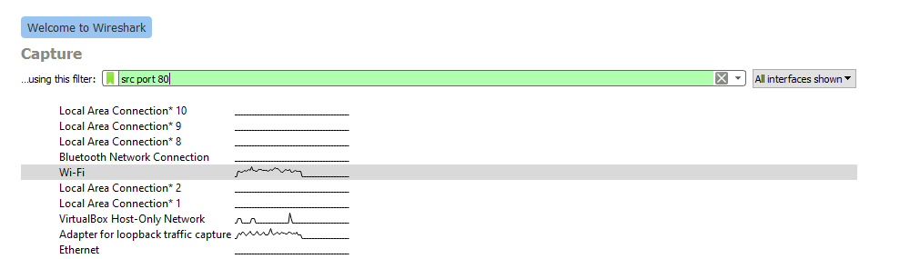
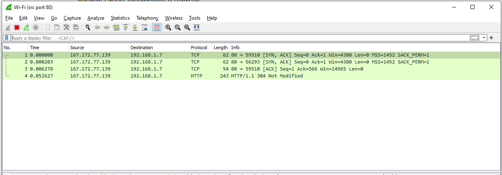
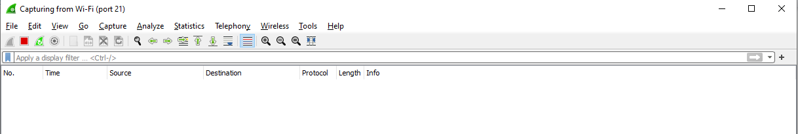
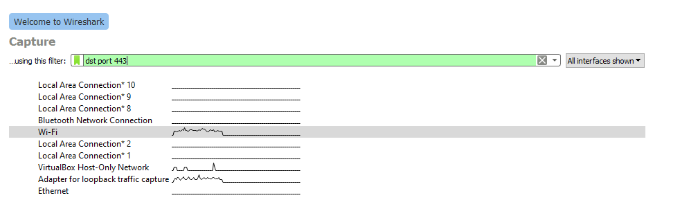
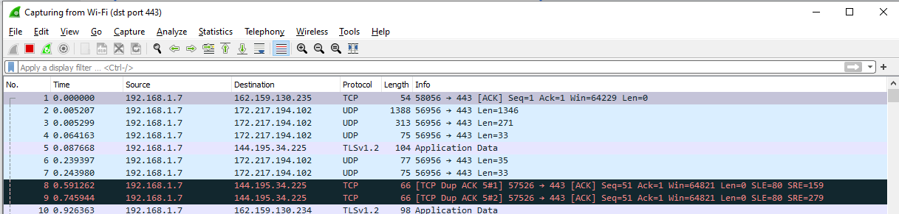
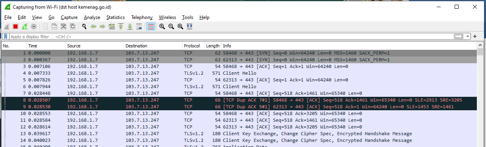
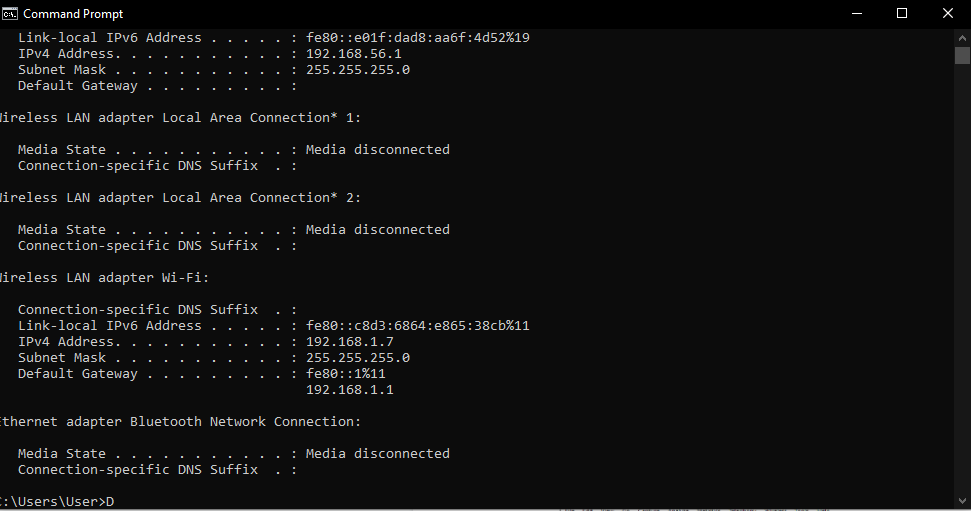
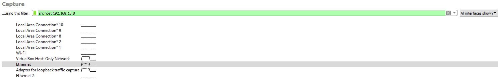
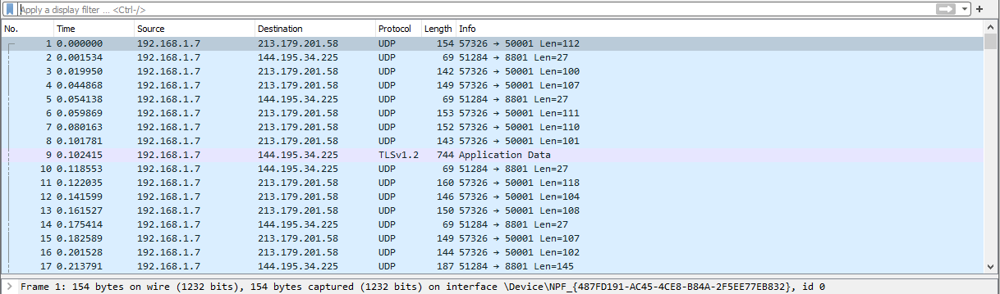

# Jarkom-Modul-1-E02-2021
 
Berikut ini adalah laporan resmi dari Praktikum Jaringan Komputer Modul 1 tahun 2021 di Institut Teknologi Sepuluh Nopember

Dokumen ini ditulis oleh
* 05111940000063 - Ryan Garnet Andrianto
* 05111940000050 - Erki Kadhafi Rosyid
* 05111940000141 - M. Farhan Haykal

# 1 Sebutkan webserver yang digunakan pada "ichimarumaru.tech"! 

Menggunakan wireshark :
a. display filter menggunakan http.host contains "ichimarumaru.tech".
b. Klik kanan lalu klik follow -> TCP stream
c. Web menggunakan server nginx/1.18.0 (Ubuntu)


# 2 Temukan paket dari web-web yang menggunakan basic authentication method!
Dengan menggunakan filter http.authbasic maka didapatkan hasil seperti berikut ini:


# 3 Ikuti perintah di basic.ichimarumaru.tech! Username dan password bisa didapatkan dari file .pcapng!
Dengan menggunakan filter “tcp.port == 80” karena web tanpa SSL menggunakan port 80.


# 4 Temukan paket mysql yang mengandung perintah query select!
Dengan menggunakan filter “tcp.port == 3306” karena mySQL mempunyai port default 3306.


# 5 Login ke portal.ichimarumaru.tech kemudian ikuti perintahnya! Username dan password bisa didapat dari query insert pada table users dari file .pcap!
Dengan menggunakan filter “tcp.port == 3306” karena MySQL mempunyai port default 3306.


# 6 Cari username dan password ketika melakukan login ke FTP Server!

FTP (File Transfer Protocol) adalah sebuah protokol yang digunakan untuk transfer file antara server dan client.
Secara _default_, port yang digunakan oleh server FTP adalah 21. Dengan demikian, tim E02 menggunakan filter `ftp && tcp.port == 21` untuk mencari paket yang dikirimkan melalui FTP.


Pada gambar di atas, client mengirimkan perintah `USER secretuser`. `secretuser` adalah username yang digunakan oleh komputer client sebagai _credentials_ untuk mengakses FTP server.

Selain username yang terekspos, password `aku.pengen.pw.aja` juga terekspos. Hal ini dikarenakan paket yang dikirim menuju ke FTP server tidak dienkripsi sehingga _packet sniffing_ dengan mudah terjadi. 


# 7 Ada 500 file zip yang disimpan ke FTP Server dengan nama 0.zip, 1.zip, 2.zip, ..., 499.zip. Simpan dan Buka file pdf tersebut. (Hint = nama pdf-nya "Real.pdf")

`Real.pdf` adalah sebuah string dengan panjang 8 karakter. Setiap karakter pada string tersebut mempunyai urutan pada tabel ASCII (American Standard Code for Information Interchange). Jika setiap nomor urutan karakter diubah menjadi bilangan heksadesimal, maka `Real.pdf` = `52 65 61 6c 2e 70 64 66`. 


Pertama-tama, tim E2 melakukan filter `ftp-data` untuk mencari data paket yang menuju ke server FTP. Kemudian, dengan menggunakan fitur pencarian di _software_ Wireshark, paket yang mengandung string `52 65 61 6c 2e 70 64 66` dicari. Setelah ditemukan, dengan fitur TCP Stream yang ada di Wireshark, file rahasia berhasil ditemukan.

Isi dari file rahasia tersebut adalah


# 8 Cari paket yang menunjukan pengambilan file dari FTP tersebut!

Pengambilan file dari FTP mempunyai istilah lain yaitu _download_. Perintah FTP yang digunakan untuk mendownload sebuah file adalah `RETR`. Dengan menggunakan filter `ftp.request.command == RETR`, semua paket yang didownload dari FTP akan tayang di Wireshark. Pada kasus ini, Wireshark tidak menampilkan paket apapun sehingga dapat disimpulkan bahwa tidak ada file yang diambil dari FTP server.


# 9 Dari paket-paket yang menuju FTP terdapat inidkasi penyimpanan beberapa file. Salah satunya adalah sebuah file berisi data rahasia dengan nama "secret.zip". Simpan dan buka file tersebut!

Permasalahan ini mirip seperti permasalahan pada nomor 7. Akan tetapi, kali ini, tim E02 menggunakan filter lain yaitu `ftp-data.command contains secret.zip` untuk mencari perintah yang dikirimkan ke server FTP yang mengandung kata `secret.zip`. 


Setelah paket ditemukan, dengan fitur TCP Stream yang ada di Wireshark, file `secret.zip` dapat didownload. File `secret.zip` yang didownload terenkripsi oleh password. Pembukaan file `secret.zip` akan dilakukan pada nomor 10.


# 10 Selain itu terdapat "history.txt" yang kemungkinan berisi history bash server tersebut! Gunakan isi dari "history.txt" untuk menemukan password untuk membuka file rahasia yang ada di "secret.zip"!

Dengan menggunakan filter `ftp-data`, semua paket data yang melalui FTP akan terekspos. Di sini, sebuah file bernama `history.txt` berisi beberapa bash command.


Berikut ini isi dari history.txt
```bash
ls
key="$(tail -1 bukanapaapa.txt)"
zip -P $key secret.zip Wanted.pdf
rm Wanted.pdf
history | tail -5 > history.txt
```

Pada script bash di atas, diketahui bahwa sebuah password ada di dalam file `bukanapaapa.txt` dan password tersebut digunakan untuk men-zip sebuah file bernama Wanted.pdf. Setelah Wanted.pdf di-zip, file Wanted.pdf dihapus.

Isi dari `bukanapaapa.txt` juga terekspos sehingga password dapat diketahui.


Setelah itu, file `secret.zip` dibuka dengan menggunakan password yang tertulis di `bukanapaapa.txt`. Berikut ini adalah isi dari Wanted.pdf.


# 11 Filter sehingga wireshark hanya mengambil paket yang berasal dari port 80!

Pada pengerjaan soal ini, cara kami untuk mendapatkan paket yang berasal dari **port 80** adalah dengan menggunakan capture filter dengan syntax `src port 80` 



dengan hasil seperti dibawah ini



# 12 Filter sehingga wireshark hanya mengambil paket yang mengandung port 21!

Pada pengerjaan soal ini, cara kami untuk mendapatkan paket yang mengandung dari **port 21** adalah dengan menggunakan capture filter dengan syntax `port 21` dengan hasil seperti dibawah ini



Tidak tercapture nya filter pada port 21 karena tidak adanya FTP yang dilakukan.

# 13 Filter sehingga wireshark hanya menampilkan paket yang menuju port 443!

Pada pengerjaan soal ini, cara kami untuk mendapatkan paket yang menuju dari **port 443** adalah dengan menggunakan capture filter dengan syntax `dst port 443`



dengan hasil seperti dibawah ini



# 14 Filter sehingga wireshark hanya mengambil paket yang tujuannya ke kemenag.go.id!

Pada pengerjaan soal ini, cara kami untuk mendapatkan paket yang menuju dari **kemenag.go.id** adalah dengan menggunakan capture filter dengan syntax `dst host kemenag.go.id` dengan hasil seperti dibawah ini



pada gambar diatas bisa dilihat bahwa semua destination menuju ip address yang sama yaitu milik **kemenag.go.id**.

# 15 Filter sehingga wireshark hanya mengambil paket yang berasal dari ip kalian!

Untuk mengerjakan soal ini, kita perlu mengetahui ip address dari device masing masing terlebih dahulu. Untuk hal ini dilakukan dengan cara membuka **cmd** dan mengetik syntax `ipconfig`



Pada hasil penacrian tersebut terlihat bahwa IPv4 dari device adalah **192.168.1.7**. Langkah selanjutnya adalah meng-capture filter dari ip yang berasal dari **192.168.1.7** dengan syntax `src host 192.168.1.7`



dengan hasil seperti dibawah ini


